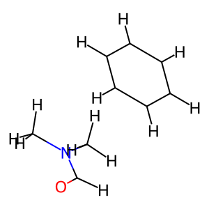
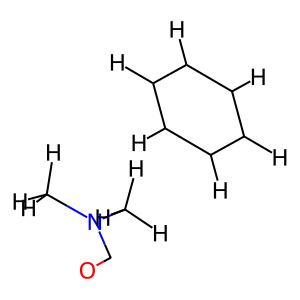

# Removing Hs connected to CNOPS

## Part 1
Set up the directory with the xyz file by running this command

```python
df = pd.read_csv("Donchev et al DES370K.csv")
extract_xyz(df)
```

## Part 2
You can run `generate_csv.py` to create the new xyzs, which correspond to the original xyz for each dimer, minus one hydrogen.

For the hydrogen to be removed it must be connected to one of C,N,O,P or S.

The resulting file, `all_xyz.csv`, contains all new generated xyzs. 
Each row includes:
- **molecule_name**: smiles of the dimer
- **xyz**: xyz of the original dimer
- **xyz_reduced**: xyz of the new dimer (without one H)
- **atom_index**: index of the removed atom in the original XYZ
- **attached_atom**: 1st connection to the removed H
- **neighboring_atoms**: neighbouring atoms to the removed H

Here are some examples of one original and one modified dimer. You can notice that the second dimer is missing one H.




# to do: read paper: why so many, why some are qm_opt_dimer; push to gh
